# InM 仪器管理系统使用手册 #

版本号：1.0  
编写：徐泡泡  
校对：四季天书  

## 1 客户端系统 ##

### 1.1 安装及配置 ###

客户端系统负责限制宿主机的使用，监控宿主机进程使用，并可以在无网络连接的情况下，离线使用或从局域网中的管理端中获取更新。  

#### 1.1.1 软件安装 ####

#### 1.1.2 添加系统服务及UAC权限 ####

#### 1.1.3 添加防火墙出站例外 ####

### 1.2 登录 ###

#### 1.2.1 用户登录 ####

输入用户名与密码即可登录，系统每次启动时会自动向服务器确认用户信息是否存在更新。如果出现用户名错误时，系统会自动向服务器拉取最新用户信息。  

登录成功后，右下角会推送系统提示，主界面隐藏，并在系统托盘上显示图标。  

>注意：普通用户与管理员均可登录。  

  
图1.1-客户端用户登录界面  

  
图1.2-客户端用户登录界面  

  
图1.3-系统托盘图标  

#### 1.2.2 主动拉取信息 ####

若管理端修改信息，用户也可以在系统运行状态下，点击 `刷新本地数据` 主动拉取最新用户列表。  

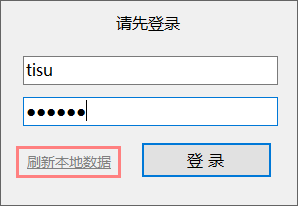  
图1.4-刷新本地数据  

### 1.3 设置 ###

管理员登录后，在系统托盘中找到 `InM` 图标，右击打开 `设置` 进入设置界面。  

>注意：仅使用管理账号登录时，才可以打开系统设置。  

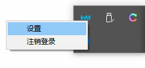  
图1.5-打开设置  

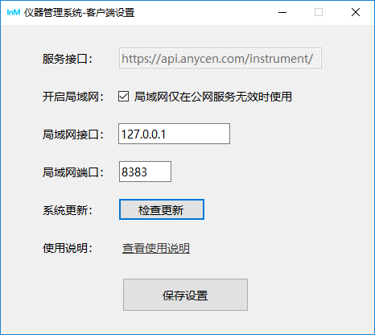  
图1.6-设置界面  

#### 1.3.1 服务接口 ####

服务接口用于设置公网服务API接口，默认不可修改。  

#### 1.3.2 开启局域网 ####

开启局域网用于设置在公网无法连接时，是否使用局域网进行数据更新，一般选择开启即可。  

#### 1.3.3 局域网接口 ####

局域网接口用于设置局域网内IP地址，用于局域网内数据通信，一般保持默认即可。  

>注意：IP地址需输入本机在局域网内的IP地址，例如：192.168.3.2  

#### 1.3.4 局域网端口 ####

局域网端口用于设置局域网内通信端口号，用于局域网内数据通信，一般保持默认即可。  

>注意：端口号必须大于8000小于60000，例如：8383  

### 1.4 系统更新 ###

## 2 管理端系统 ##

### 2.1 安装及配置 ###

#### 2.1.1 软件安装 ####

#### 2.1.2 添加防火墙入站例外 ####

### 2.2 登录 ###

#### 2.2.1 管理员登录 ####

输入用户名与密码即可登录，系统每次启动时会自动向服务器确认用户信息是否存在更新。  

>注意：管理端仅允许管理员账号登录。  

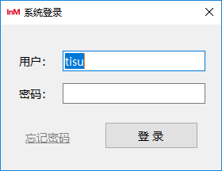  
图2.1-管理端用户登录界面  

#### 2.2.2 忘记登录密码 ####

忘记登录密码时，可联系管理员，使用 `PasswordKey` 重置管理员密码。  

获取 PasswordKey 的方式为通过邮箱获取。  

>请妥善保管 PasswordKey  

### 2.3 日志查询 ###

#### 2.3.1 按用户名及时间查询 ####

框选： `按用户查询`  

点击用户名下拉框，选择需要查询的用户；点击时间下拉框，选择固定时间：  

+ 今日数据
+ 最近三天
+ 最近七天
+ 最近一月（30天）

点击查询即可显示该用户在某时间段内详细使用信息。  

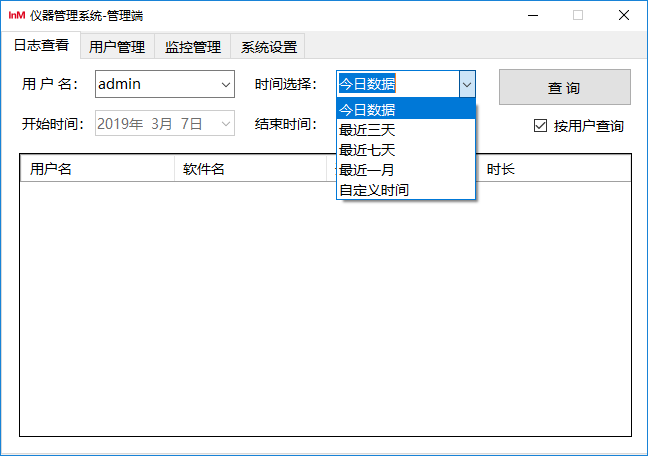  
图2.2-使用用户名与固定时间查询  

#### 2.3.2 仅使用时间查询 ####

取消框选： `按用户查询`  

此时可仅需要选择时间，点击查询即可显示所有用户在某时间段内详细使用信息。  

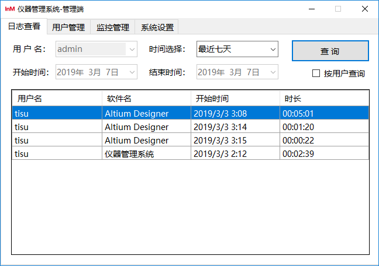  
图2.3-仅使用时间查询  

#### 2.3.3 自定义时间查询 ####

时间选择：`自定义时间`  

此时，`开始时间` 与 `结束时间` 可用，点击日期下拉框，选择要查询的起止时间，点击查询，即可显示日志信息。  

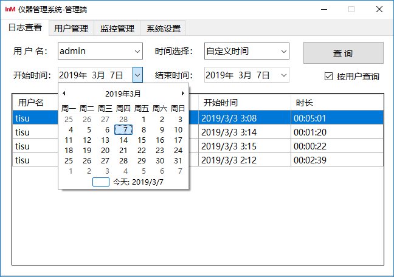  
图2.4-使用自定义时间查询  

### 2.4 用户管理 ###

#### 2.4.1 新建用户 ####

打开用户管理页面，点击右下角 `新建用户` 打开新建用户窗口。  

依次填入：用户名、用户密码、确认密码  

选择`用户级别`：  

+ 普通用户
+ 管理员

点击确定以新建用户。  

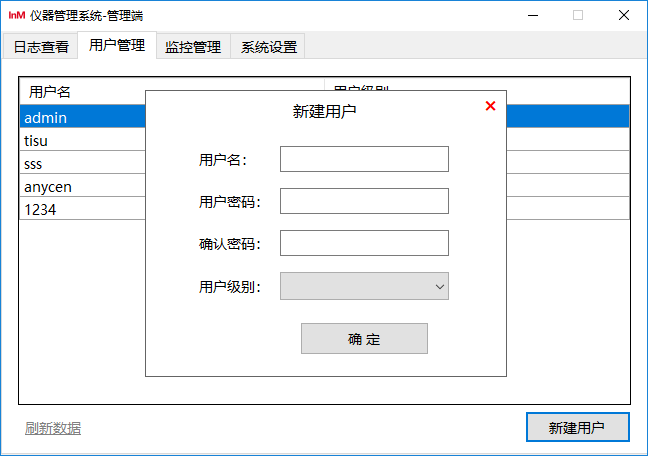  
图2.5-新建用户  

#### 2.4.2 编辑用户 ####

打开用户管理页面，双击用户列表打开编辑用户窗口。  

依次修改：用户名、用户密码、确认密码  

>注意：编辑信息可以选择性修改。  

修改`用户级别`：  

+ 普通用户
+ 管理员

点击确定以编辑用户信息。  

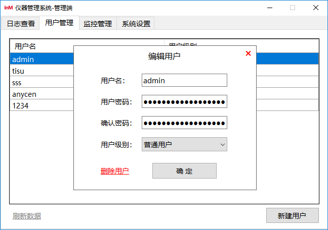  
图2.6-编辑用户  

#### 2.4.3 删除用户 ####

打开用户管理页面，双击用户列表打开编辑用户窗口。  

点击左下角`删除用户`打开确认删除提示。  

点击确定以删除用户，点击取消则结束该操作。  

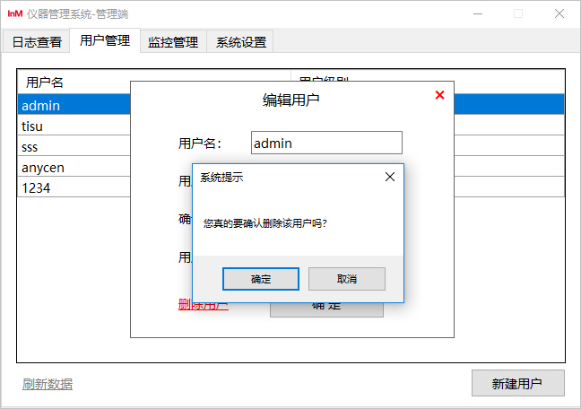  
图2.7-删除用户  

### 2.5 进程管理 ###

#### 2.5.1 新建进程监控 ####

打开进程监控页面，点击右下角 `新建监控` 打开新建进程监控窗口。  

依次填入：软件名称、进程名称  

选择`进程类型`：  

+ EXE
+ MSI
+ VBS

点击确定以新建进程监控。  

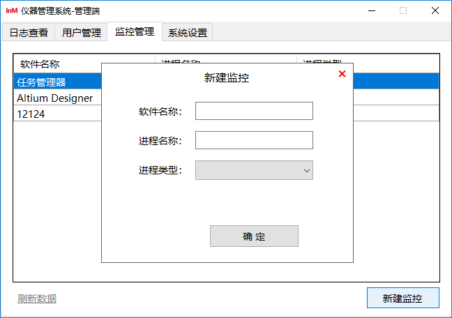  
图2.8-新建进程监控  

#### 2.5.2 编辑进程监控 ####

打开进程监控页面，双击进程监控列表打开编辑进程监控窗口。  

依次修改：软件名称、进程名称  

>注意：编辑信息可以选择性修改。  

修改`进程类型`：  

+ EXE
+ MSI
+ VBS

点击确定以编辑进程监控信息。  

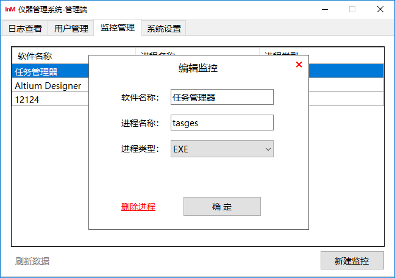  
图2.9-编辑进程监控  

#### 2.5.3 删除进程监控 ####

打开进程监控页面，双击进程监控列表打开编辑进程监控窗口。  

点击左下角`删除进程`打开确认删除提示。  

点击确定以删除进程监控，点击取消则结束该操作。  

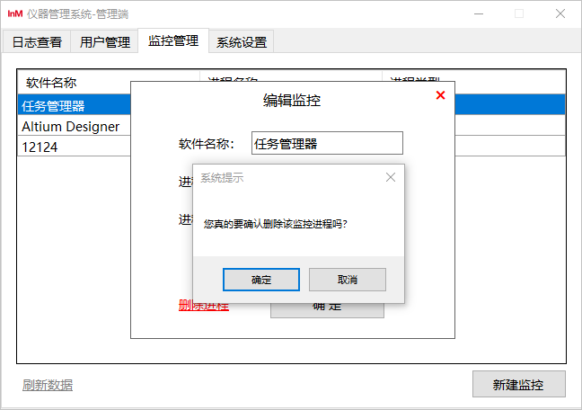  
图2.10-删除进程监控  

### 2.6 系统设置 ###

点击 `系统设置` 菜单，进入设置界面。  

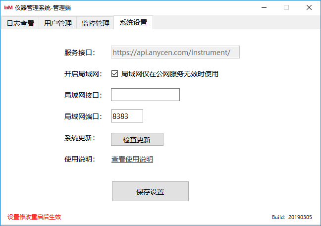  
图2.11-设置界面  

#### 2.6.1 服务接口 ####

服务接口用于设置公网服务API接口，默认不可修改。  

#### 2.6.2 开启局域网 ####

开启局域网用于设置在公网无法连接时，是否使用局域网进行数据更新，一般选择开启即可。  

#### 2.6.3 局域网接口 ####

局域网接口用于设置局域网内IP地址，用于局域网内数据通信，一般保持默认即可。  

>注意：IP地址需输入本机在局域网内的IP地址，例如：192.168.3.2  

#### 2.6.4 局域网端口 ####

局域网端口用于设置局域网内通信端口号，用于局域网内数据通信，一般保持默认即可。  

>注意：端口号必须大于8000小于60000，例如：8383  

### 2.7 系统更新 ###

## 3 系统接口 ##

详见接口开发文档  