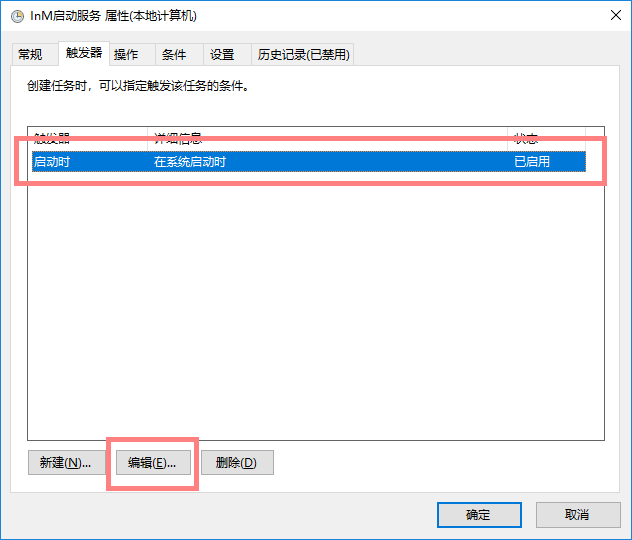
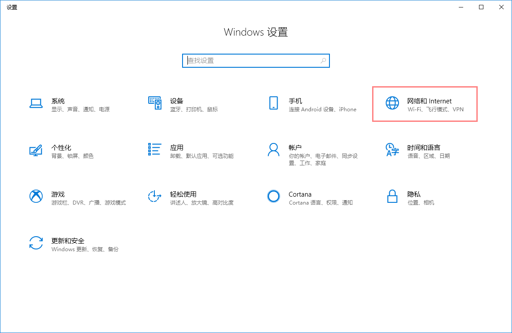
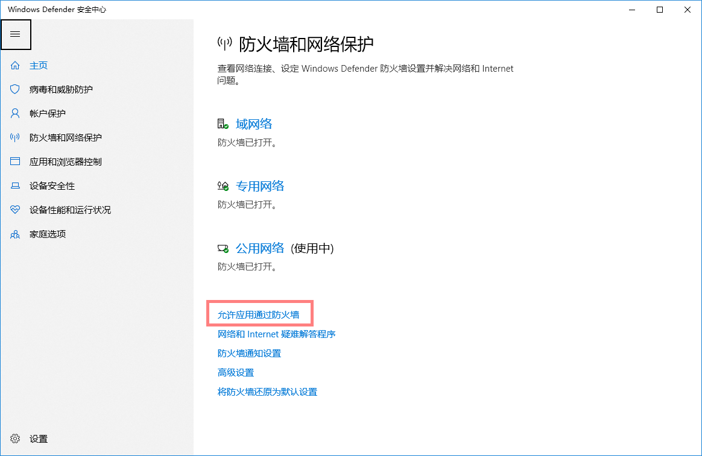
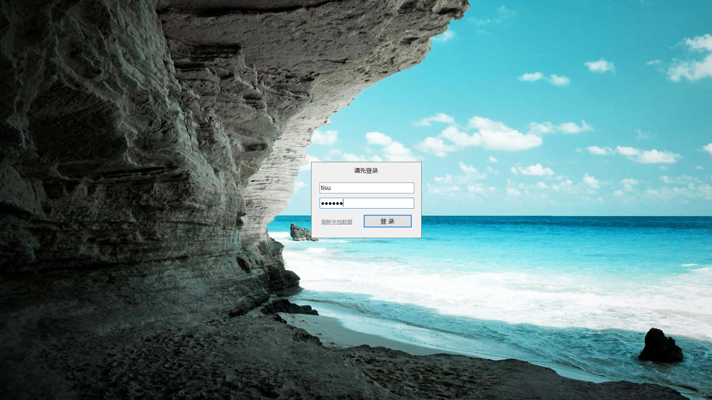

# InM 仪器管理系统使用手册 #

版本号：2.3  
编写：徐泡泡  
校对：四季天书、Loco

## 1 客户端系统 ##

### 1.1 安装及配置 ###

客户端系统负责限制宿主机的使用，监控宿主机进程使用，并可以在无网络连接的情况下，离线使用或从局域网中的管理端中获取更新。  

#### 1.1.1 软件安装 ####

  
图1.1-安装包文件夹  

1、如果系统为windows7 sp1 ，可以直接双击打开 `setup.exe`  
可以自动安装 `.Net Framwork 4.6` ,再安装管理端软件。  

2、如果已经确认安装 `.Net Framwork 4.5` 或以上版本  
可以直接双击打开 `InMAdminSetup.msi` 直接安装管理端软件。

#### 1.1.2 添加系统任务及管理员权限 ####

Windows下，使用 `搜索` 或 `Cortana` 搜索 `任务计划程序`  打开任务计划程序设置。

  
图1.2-搜索任务计划程序  

在任务计划程序中打开 `创建基本任务`。  

  
图1.3-任务计划程序  

在创建基本任务页面中填写 `名称` 并点击 `下一步` 。  

  
图1.4-创建基本任务  

在触发器页面中选择 `计算机启动时` 并点击 `下一步` 。  

  
图1.5-触发器  

在操作页面中选择 `启动程序` 并点击 `下一步` 。  

  
图1.6-操作  

在启动程序页面中点击 `浏览` 选择 `InM.exe` ,并点击 `下一步` 。  

  
图1.7-启动程序  

在完成页面中选择 `当单击“完成”时，打开此任务属性的对话框` ,并点击 `完成` 。  

  
图1.8-启动程序  

在启动属性窗口中 `常规` 页面，选中 `使用最高权限运行` ，点击 `更改用户或组` 进行用户选择。  

  
图1.9-启动属性  

在选择用户或组窗口中点击 `高级` 进行用户组查找。  

  
图1.10-选择用户或组  

点击 `立即查找` ，在搜索结果中选择 `Administrators` 并单击确定。  

  
图1.11-选择用户或组（查找用户）  

确定用户账户为 `BUILTIN\Administrators` ， `使用最高权限运行` 已被勾选，点击触发器页面。

  
图1.12-确认信息  

在触发器页面调整 `为所有用户登录时`。

  
图1.13-触发器属性  

  
图1.14-编辑触发器  

完成设置，重启后生效。

#### 1.1.3 添加防火墙出站例外 ####

---

##### Windows 10 系统下 #####

打开系统设置界面，选择 `网络和 Internet`。  

  
图1.15-系统设置界面  

在 `状态` 中，选择 `Windows 防火墙`。  

  
图1.16-网络和 Internet  

在 `防火墙和网络保护` 中，选择 `允许应用通过防火墙`。  

  
图1.17-允许应用通过防火墙  

在 `允许的应用` 中，点击 `更改设置` 解锁保护后点击 `允许其他应用` 用以添加其他应用。  

  
图1.18-允许的应用  

在 `添加应用` 中，点击 `浏览` 选择 `InM.exe` ，点击打开添加防火墙例外。  

  
图1.19-添加应用  

  
图1.20-浏览  

### 1.2 登录 ###

#### 1.2.1 用户登录 ####

输入用户名与密码即可登录，系统每次启动时会自动向服务器确认用户信息是否存在更新。如果出现用户名错误时，系统会自动向服务器拉取最新用户信息。  

登录成功后，右下角会推送系统提示，主界面隐藏，并在系统托盘上显示图标。  

>注意：普通用户与管理员均可登录。  

  
图1.21-客户端用户登录界面  

  
图1.22-客户端用户登录界面  

  
图1.23-系统托盘图标  

#### 1.2.2 主动拉取信息 ####

若管理端修改信息，用户也可以在系统运行状态下，点击 `刷新本地数据` 主动拉取最新用户列表。  

  
图1.24-刷新本地数据  

#### 1.2.3 关机 ####

  
图1.25-右下角操作界面  

点击 `关机`，会提示是否确认关机，点击是，将会倒计时1分钟后关闭计算机。  

#### 1.2.4 注册用户 ####

  
图1.26-注册用户界面  

点击 `用户注册`，按照提示输入用户注册信息，点击注册后，等待或通知管理员进行审核。

### 1.3 设置 ###

管理员登录后，在系统托盘中找到 `InM` 图标，右击打开 `设置` 进入设置界面。  

>注意：仅使用管理账号登录时，才可以打开系统设置。  

  
图1.27-打开设置  

  
图1.28-设置界面  

#### 1.3.1 服务接口 ####

服务接口用于设置公网服务API接口，默认不可修改。  

#### 1.3.2 开启局域网 ####

开启局域网用于设置在公网无法连接时，是否使用局域网进行数据更新，一般选择开启即可。  

#### 1.3.3 局域网接口 ####

局域网接口用于设置局域网内IP地址，用于局域网内数据通信，一般保持默认即可。  

>注意：IP地址需输入本机在局域网内的IP地址，例如：192.168.3.2  

#### 1.3.4 局域网端口 ####

局域网端口用于设置局域网内通信端口号，用于局域网内数据通信，一般保持默认即可。  

>注意：端口号必须大于8000小于60000，例如：8383  

### 1.4 系统更新 ###

## 2 管理端系统 ##

### 2.1 安装及配置 ###

#### 2.1.1 软件安装 ####

  
图2.1-安装包文件夹  

1、如果系统为windows7 sp1 ，可以直接双击打开 `setup.exe`  
可以自动安装 `.Net Framwork 4.6` ,再安装管理端软件。  

2、如果已经确认安装 `.Net Framwork 4.5` 或以上版本  
可以直接双击打开 `InMSetup.msi` 直接安装管理端软件。

#### 2.1.2 添加防火墙入站例外 ####

---

##### Windows 10 系统下 #####

打开系统设置界面，选择 `网络和 Internet`。  

  
图2.2-系统设置界面  

在 `状态` 中，选择 `Windows 防火墙`。  

  
图2.3-网络和 Internet  

在 `防火墙和网络保护` 中，选择 `允许应用通过防火墙`。  

  
图2.4-允许应用通过防火墙  

在 `允许的应用` 中，点击 `更改设置` 解锁保护后点击 `允许其他应用` 用以添加其他应用。  

  
图2.5-允许的应用  

在 `添加应用` 中，点击 `浏览` 选择 `InM.Admin.exe` ，点击打开添加防火墙例外。  

  
图2.6-添加应用  

  
图2.7-浏览  

### 2.2 登录 ###

#### 2.2.1 管理员登录 ####

输入用户名与密码即可登录，系统每次启动时会自动向服务器确认用户信息是否存在更新。  

>注意：管理端仅允许管理员账号登录。  

  
图2.8-管理端用户登录界面  

#### 2.2.2 忘记登录密码 ####

忘记登录密码时，可联系管理员，使用 `PasswordKey` 重置管理员密码。  

获取 PasswordKey 的方式为通过邮箱获取。  

>请妥善保管 PasswordKey  

### 2.3 新用户审核 ###

  
图2.9-管理端用户登录界面  

管理员可以审核自行注册的用户，或删除有问题的注册信息。  

通过注册信息后，可以刷新用户列表获取最新信息。  

>管理员可以右击鼠标刷新页面  

### 2.4 日志查询 ###

#### 2.4.1 按用户名及时间查询 ####

框选： `按用户查询`  

点击用户名下拉框，选择需要查询的用户；点击时间下拉框，选择固定时间：  

+ 今日数据
+ 最近三天
+ 最近七天
+ 最近一月（30天）

点击查询即可显示该用户在某时间段内详细使用信息。  

  
图2.10-使用用户名与固定时间查询  

#### 2.4.2 仅使用时间查询 ####

取消框选： `按用户查询`  

此时可仅需要选择时间，点击查询即可显示所有用户在某时间段内详细使用信息。  

  
图2.11-仅使用时间查询  

#### 2.4.3 自定义时间查询 ####

时间选择：`自定义时间`  

此时，`开始时间` 与 `结束时间` 可用，点击日期下拉框，选择要查询的起止时间，点击查询，即可显示日志信息。  

  
图2.12-使用自定义时间查询  

### 2.5 用户管理 ###

>注意：所有用户管理操作，均在管理端完成，客户端不涉及相关操作。

#### 2.5.1 新建用户 ####

打开用户管理页面，点击右下角 `新建用户` ，打开新建用户窗口。  

依次填入：用户名、用户密码、确认密码  

选择`用户级别`：  

+ 普通用户
+ 管理员

点击确定以新建用户。  

  
图2.13-新建用户  

#### 2.5.2 编辑用户 ####

打开用户管理页面，双击用户列表打开编辑用户窗口。  

依次修改：用户名、用户密码、确认密码  

>注意：编辑信息可以选择性修改。  

修改`用户级别`：  

+ 普通用户
+ 管理员

点击确定以编辑用户信息。  

  
图2.14-编辑用户  

#### 2.5.3 删除用户 ####

打开用户管理页面，双击用户列表打开编辑用户窗口。  

点击左下角`删除用户` ，打开确认删除提示。  

点击确定以删除用户，点击取消则结束该操作。  

  
图2.15-删除用户  

### 2.6 进程管理 ###

>注意：所有进程监控管理操作，均在管理端完成，客户端不涉及相关操作。

>由管理员设置需要监控的进程，若客户端宿主机上运行相关进程，则会每30s上传一次使用日志。若客户端宿主机上未运行相关进程，则不会由日志数据产生。

#### 2.6.1 新建进程监控 ####

打开进程监控页面，点击右下角 `新建监控` ，打开新建进程监控窗口。  

依次填入：软件名称、进程名称  

选择`进程类型`：  

+ EXE
+ MSI
+ VBS

点击确定以新建进程监控。  

  
图2.16-新建进程监控  

#### 2.6.2 编辑进程监控 ####

打开进程监控页面，双击进程监控列表打开编辑进程监控窗口。  

依次修改：软件名称、进程名称  

>注意：编辑信息可以选择性修改。  

修改`进程类型`：  

+ EXE
+ MSI
+ VBS

点击确定以编辑进程监控信息。  

  
图2.17-编辑进程监控  

#### 2.6.3 删除进程监控 ####

打开进程监控页面，双击进程监控列表打开编辑进程监控窗口。  

点击左下角`删除进程` ，打开确认删除提示。  

点击确定以删除进程监控，点击取消则结束该操作。  

  
图2.18-删除进程监控  

### 2.7 系统设置 ###

点击 `系统设置` 菜单，进入设置界面。  

  
图2.19-设置界面  

#### 2.7.1 服务接口 ####

服务接口用于设置公网服务API接口，默认不可修改。  

#### 2.7.2 开启局域网 ####

开启局域网用于设置在公网无法连接时，是否使用局域网进行数据更新，一般选择开启即可。  

#### 2.7.3 局域网接口 ####

局域网接口用于设置局域网内IP地址，用于局域网内数据通信，一般保持默认即可。  

>注意：IP地址需输入本机在局域网内的IP地址，例如：192.168.3.2  

#### 2.7.4 局域网端口 ####

局域网端口用于设置局域网内通信端口号，用于局域网内数据通信，一般保持默认即可。  

>注意：端口号必须大于8000小于60000，例如：8383  

### 2.8 系统更新 ###

## 3 系统接口 ##

详见接口开发文档  